<div align="center">


# Señal

**A self-hosted RSS reader that brings the full article into the app and writes a TL;DR with AI.**
Built to run on a Raspberry Pi 4B with a local LLM, and just as happy on a VPS, Docker or your desktop.

[](https://github.com/jipixz/RSS-Feed/actions/workflows/ci.yml)
[](LICENSE)
[](https://github.com/jipixz/RSS-Feed/releases)

[](https://nestjs.com)
[](https://react.dev)
[](https://www.typescriptlang.org)
[](https://www.prisma.io)

[](https://vite.dev)
[](https://web.dev/progressive-web-apps/)
[](https://ollama.com)
[](https://docs.anthropic.com)
[](https://jestjs.io)
[](https://www.raspberrypi.com)

*[Léelo en español](README.es.md)*

</div>

---

## Screenshots

| "Today", ranked by meaning | Full article with its TL;DR | Audiobook: Kokoro or Piper |
|:---:|:---:|:---:|
| 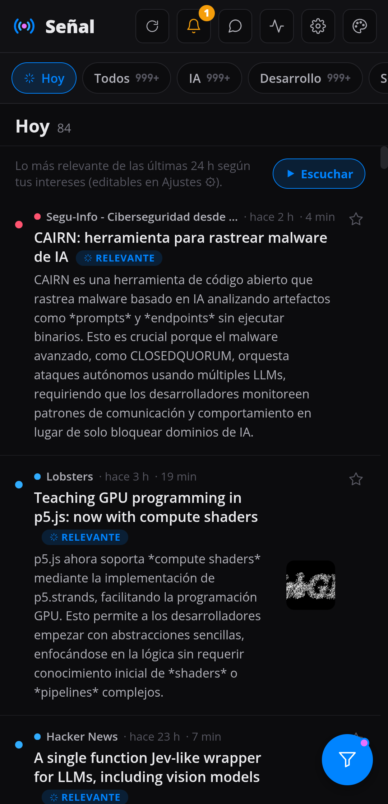 | 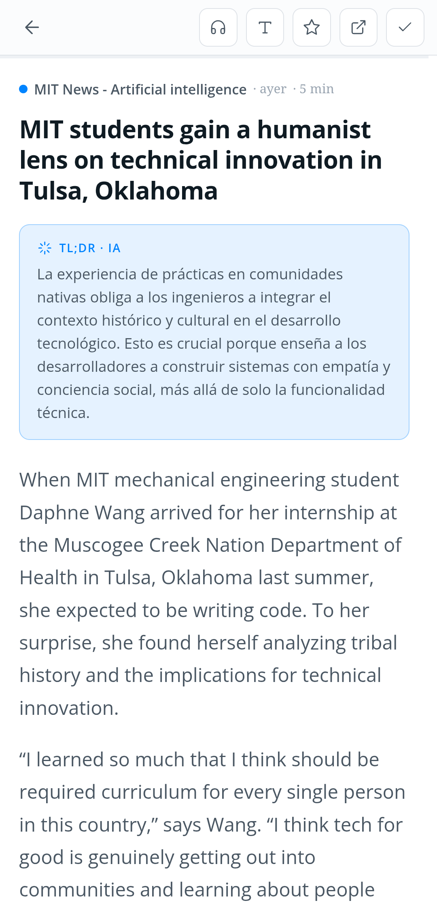 | 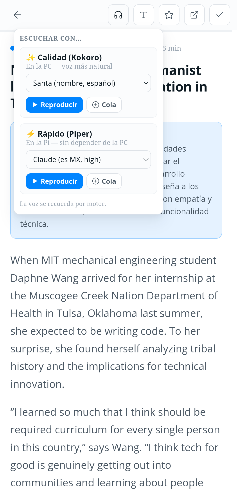 |

| Live AI console | Folders, search and muted words |
|:---:|:---:|
| 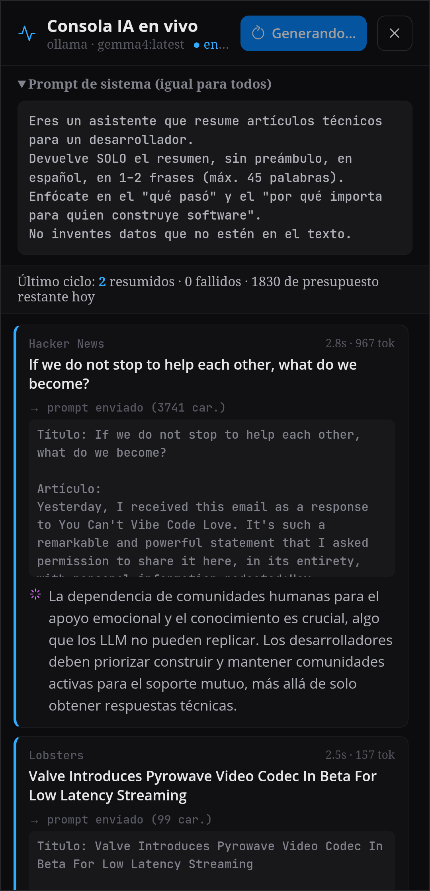 | 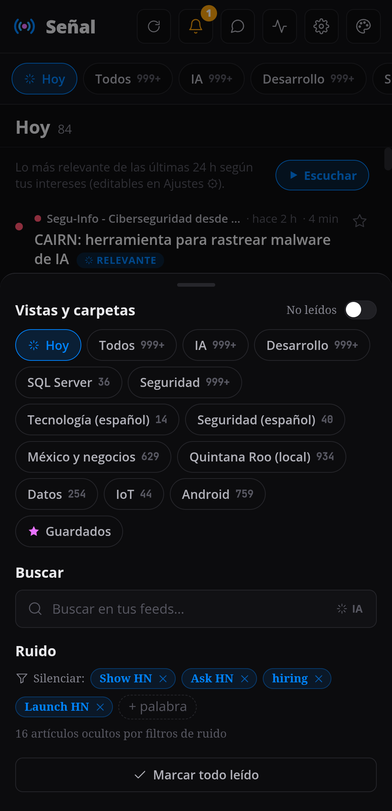 |

<details>
<summary><b>Five themes</b> and the interest profile that ranks "Today"</summary>

<br/>

| Light | Sepia | Café | Dark | Black |
|:---:|:---:|:---:|:---:|:---:|
| 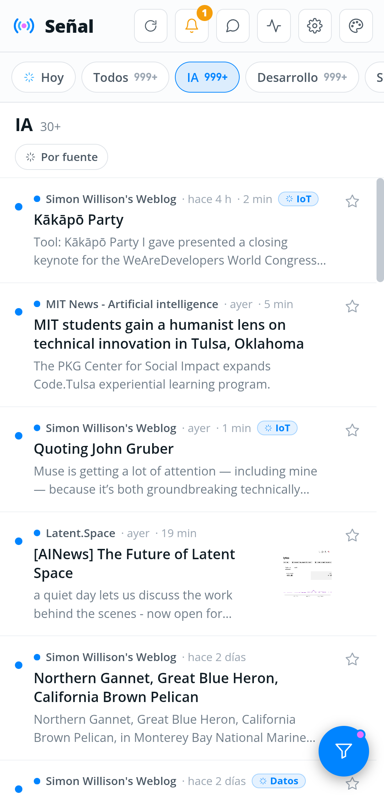 | 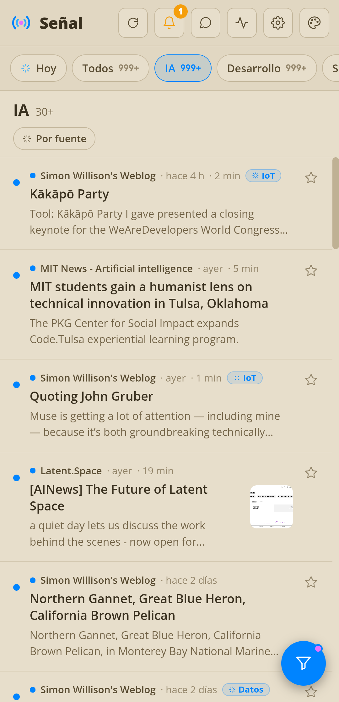 | 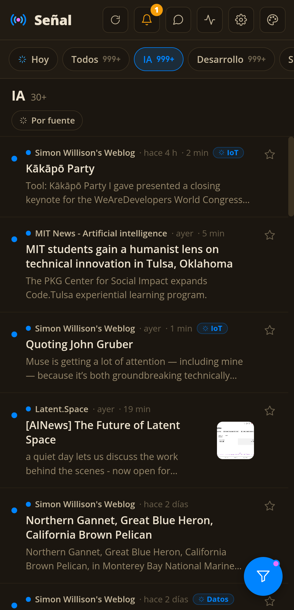 | 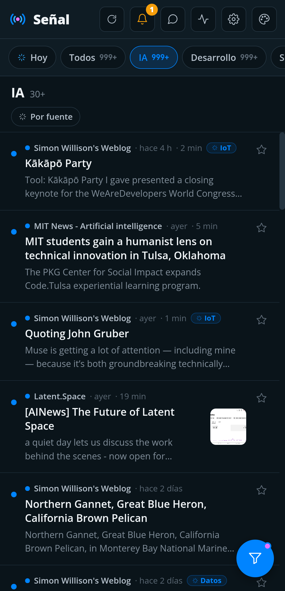 |  |

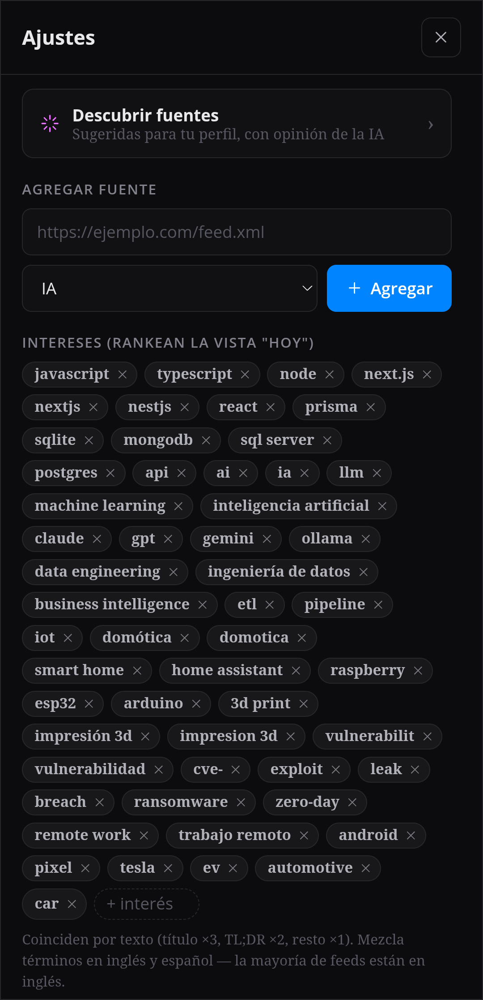

</details>

---

## Why it exists

I couldn't find an RSS reader with the configuration I needed: the full article inside the app,
muted topics, ranking by what is relevant *to me*, and a one-line summary before deciding whether
to read. So I built my own, with three constraints:

1. **Reading never waits on AI.** If the model is down, articles still show up; the TL;DR is filled in later.
2. **It has to fit on a Raspberry Pi.** One SQLite file, one Node process, a hard memory ceiling.
3. **No lock-in.** Local model, cloud model or no model at all, switched from `.env`.

## Features

- **Full article content** extracted in-app (Mozilla Readability + `sanitize-html`), no bouncing to the site.
- **TL;DR in 1-2 sentences** per article through a switchable provider: `ollama` (local) · `anthropic` (Claude) · `none`, with a daily budget.
- **"Today" digest ranked by meaning**, not keywords: embeddings (`nomic-embed-text`) compared against an interest profile, with keyword fallback.
- **Semantic search, related articles and topic classification**, all reusing the same embeddings (cosine similarity against per-folder centroids).
- **Noise control:** muted words, cross-source de-duplication of the same story.
- **Audiobook mode:** text-to-speech with Piper (on the Pi) or Kokoro (GPU on a desktop), with a play queue and lock-screen controls.
- **Live AI console** streaming each summary over SSE, plus a small chat with the model.
- **Installable PWA** with themes, accent color, column width and reading-size preferences.
- **Health alerts** in the app when feeds fail or ingestion stalls.

## Architecture

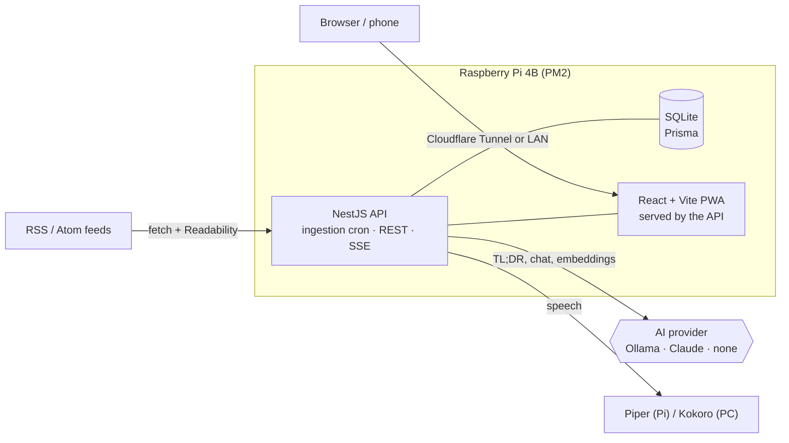

The AI layer is a **Strategy + Factory** behind an injection token, so the provider is chosen at
boot from configuration and every service depends only on the interface.

## Engineering notes

A few problems worth reading about in the commit history:

- **Out-of-memory crash loop on the Pi.** Ranking and centroid calculation loaded every embedding into
  a 512 MB heap on each ingestion cycle. Fixed by walking embeddings in cursor-paginated batches of 400 and
  keeping a bounded top-K, with regression tests for both.
- **Ingestion that hung forever.** A `running` flag could stay stuck after a hung model call. Fixed with a
  global watchdog (`Promise.race` timeout) plus a stale-lock guard, so the flag is always released.
- **Measured before optimizing.** `gemma4` (~10 GB) does not fit in an 8 GB GPU and runs split across CPU
  and GPU, so it looked like a speed problem. A 3-article benchmark against `qwen2.5-coder:7b` and
  `deepseek-r1:8b` (both 100% on GPU) said otherwise: 3.1 s per summary vs 1.7 s and 2.2 s, irrelevant for a
  background job. The real difference was quality: gemma kept to the length limit every time, but stated an
  ongoing investigation as established fact. So the model stayed and the prompt changed instead: it now keeps
  the source's degree of certainty, verified on 6 articles including two confirmed-fact controls so it did not
  turn timid.
- **Embeddings on CPU.** `nomic-embed-text` runs on CPU (~50 ms per article): effectively free there, and it
  leaves every MB of VRAM to the summarizer, which already does not fit.
- **Local models that "think".** Hybrid-reasoning models can spend the whole token budget thinking and return
  empty content; summaries send `think: false`, with a retry for servers that do not support it.

## Quick start

```bash
pnpm install
cp .env.example .env        # set OLLAMA_BASE_URL, or AI_PROVIDER=none to start without AI
pnpm prisma:migrate         # creates data/senal.db and seeds 16 feeds
pnpm --filter api dev       # API + built frontend on http://localhost:3001
pnpm --filter web dev       # optional: Vite dev server with HMR on :5173
```

Run the tests:

```bash
pnpm --filter api test
```

Deploying to a Raspberry Pi (PM2 or Docker), TTS setup, switching to Claude and the full list of
environment variables are documented in the [Spanish README](README.es.md) and in [`docs/`](docs):
[AI providers](docs/proveedores-ia.md) · [Hosting](docs/hosting.md) ·
[Authentication](docs/autenticacion.md) · [Customization](docs/personalizacion.md).

## Tech stack

| Layer | Tools |
|---|---|
| Backend | NestJS 11, Prisma, SQLite, `@nestjs/schedule`, `rss-parser`, Readability + jsdom, `sanitize-html` |
| Frontend | React 19, Vite, TypeScript, PWA (service worker + manifest) |
| AI | Ollama (Gemma, `nomic-embed-text`), Anthropic Claude API |
| Speech | Piper, Kokoro |
| Ops | PM2, Docker, Cloudflare Tunnel |
| Tests | Jest + ts-jest |

## How it was built

The first version was written by hand from a written spec ([`docs/SPEC.md`](docs/SPEC.md)); later
features were built with **Claude Code**, with me directing and reviewing the changes.
[`APRENDIZAJES.md`](APRENDIZAJES.md) collects the technical notes gathered along the way
(NestJS DI, design patterns, SSE, security), in Spanish.

## License

[MIT](LICENSE) © Gibrán Ramón Perera
