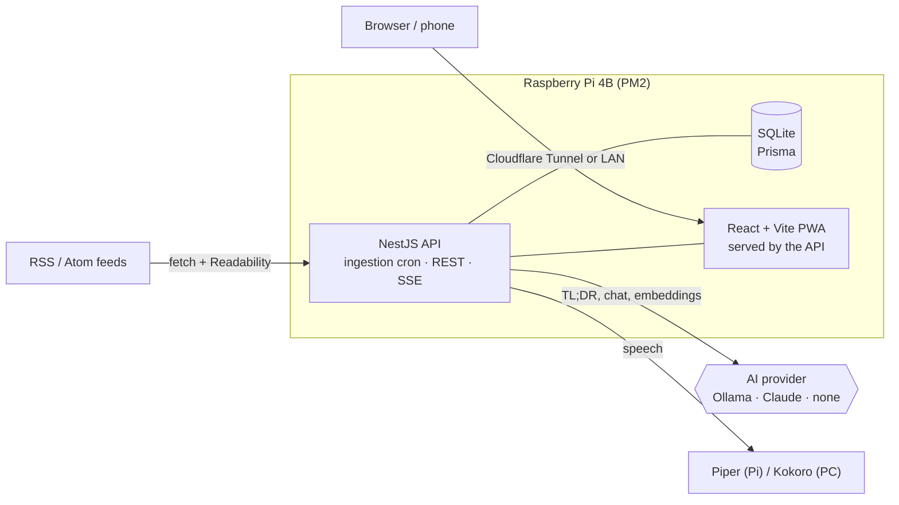

<div align="center">


# Señal

**A self-hosted RSS reader that brings the full article into the app and writes a TL;DR with AI.**
Built to run on a Raspberry Pi 4B with a local LLM, and just as happy on a VPS, Docker or your desktop.

[](https://github.com/jipixz/RSS-Feed/actions/workflows/ci.yml)
[](LICENSE)
[](https://github.com/jipixz/RSS-Feed/releases)

[](https://nestjs.com)
[](https://react.dev)
[](https://www.typescriptlang.org)
[](https://www.prisma.io)

[](https://vite.dev)
[](https://web.dev/progressive-web-apps/)
[](https://ollama.com)
[](https://docs.anthropic.com)
[](https://jestjs.io)
[](https://www.raspberrypi.com)

*[Léelo en español](README.es.md)*

</div>

---

## Screenshots

| "Today", ranked by meaning | Full article with its TL;DR | Audiobook: Kokoro or Piper |
|:---:|:---:|:---:|
|  |  |  |

| Live AI console | Folders, search and muted words |
|:---:|:---:|
|  |  |

<details>
<summary><b>Five themes</b> and the interest profile that ranks "Today"</summary>

<br/>

| Light | Sepia | Café | Dark | Black |
|:---:|:---:|:---:|:---:|:---:|
|  |  |  |  |  |


</details>

---

## Why it exists

I couldn't find an RSS reader with the configuration I needed: the full article inside the app,
muted topics, ranking by what is relevant *to me*, and a one-line summary before deciding whether
to read. So I built my own, with three constraints:

1. **Reading never waits on AI.** If the model is down, articles still show up; the TL;DR is filled in later.
2. **It has to fit on a Raspberry Pi.** One SQLite file, one Node process, a hard memory ceiling.
3. **No lock-in.** Local model, cloud model or no model at all, switched from `.env`.

## Features

- **Full article content** extracted in-app (Mozilla Readability + `sanitize-html`), no bouncing to the site.
- **TL;DR in 1-2 sentences** per article through a switchable provider: `ollama` (local) · `anthropic` (Claude) · `none`, with a daily budget.
- **"Today" digest ranked by meaning**, not keywords: embeddings (`nomic-embed-text`) compared against an interest profile, with keyword fallback.
- **Semantic search, related articles and topic classification**, all reusing the same embeddings (cosine similarity against per-folder centroids).
- **Noise control:** muted words, cross-source de-duplication of the same story.
- **Audiobook mode:** text-to-speech with Piper (on the Pi) or Kokoro (GPU on a desktop), with a play queue and lock-screen controls.
- **Live AI console** streaming each summary over SSE, plus a small chat with the model.
- **Installable PWA** with themes, accent color, column width and reading-size preferences.
- **Health alerts** in the app when feeds fail or ingestion stalls.

## Architecture



The AI layer is a **Strategy + Factory** behind an injection token, so the provider is chosen at
boot from configuration and every service depends only on the interface.

## Engineering notes

A few problems worth reading about in the commit history:

- **Out-of-memory crash loop on the Pi.** Ranking and centroid calculation loaded every embedding into
  a 512 MB heap on each ingestion cycle. Fixed by walking embeddings in cursor-paginated batches of 400 and
  keeping a bounded top-K, with regression tests for both.
- **Ingestion that hung forever.** A `running` flag could stay stuck after a hung model call. Fixed with a
  global watchdog (`Promise.race` timeout) plus a stale-lock guard, so the flag is always released.
- **A benchmark that did not survive being redone.** `gemma4` (9.6 GB) does not fit in an 8 GB GPU and runs
  split across CPU and GPU, so it looked like a speed problem. A hand-run comparison over 3 articles said the
  7B alternatives were roughly twice as fast. Re-run through the eval harness — same 40 cases, same prompt,
  120 observations per model — the gap vanished: **3.10 s** for `gemma4:latest`, **3.20 s** for
  `deepseek-r1:8b`, **3.56 s** for `qwen2.5-coder:7b`. Two runs of the *same* model differed by more (2.70 s
  vs 3.10 s) than the models differ from each other, so the 3-article benchmark was noise. Normalising by
  output tells the rest: `gemma4` sits 66% on CPU (`ollama ps`, 10 GB loaded) against 92% on GPU for
  `qwen2.5-coder:7b`, and still wins on seconds per summary because it writes ~12 fewer words. Per word
  generated the GPU-resident models *are* ahead — 14.4 and 14.1 words/s against 12.9 — which puts the real
  payoff of fitting in VRAM at around 10%, not 100%.
- **The trade-off that is real, and does not favour the current choice.** On the same runs,
  `qwen2.5-coder:7b` preserves attribution **96.7%** of the time against `gemma4`'s **73.3%** — but it
  overshoots the 45-word limit in 6 of 10 summaries, where `gemma4` overshoots in 1 of 10. The two metrics
  are not independent: condensing is exactly what drops the hedge, so a 51-word summary has room for the
  *"according to a report"* that a 40-word one cuts. That biases the comparison toward the longer model.
  Per-model numbers in [`evals/MODELS.md`](evals/MODELS.md); the follow-up experiment is below.
- **The follow-up experiment, including the arm that failed.** To separate "better model" from "more verbose
  model", the length limit was tightened through the prompt in two arms — one that just enforces the 45 words,
  one that also says what to cut first (detail yes, attribution never) — and compared paired, case by case,
  since every arm ran the same 40 cases. Three results, in
  [`evals/EXPERIMENT-length.md`](evals/EXPERIMENT-length.md):
  (1) **Condensing really does cost attribution.** Forcing `gemma4` from 39.8 to 35.3 words dropped it
  **-10.0 pts ± 9.6**, the only effect in the experiment that clears its own noise band.
  (2) **But that is not what separates the models.** Within `gemma4`, length explains nothing on its own
  (73.6% for summaries under the limit against 71.4% for those over it), and at matched length
  `qwen2.5-coder:7b` still leads 88.9% to 73.6%.
  (3) **The arm meant to settle it could not run.** Told to enforce the limit, `qwen2.5-coder:7b` wrote
  *longer* (51.4 → 55.5 words) and complied less. The manipulation failed, so its attribution under that arm
  says nothing — and a model that cannot be held to a length limit is disqualified for this use case anyway,
  independently of the question being asked.
  The usable outcome is the cheap one: on `gemma4`, enforcing the limit **and** naming what to sacrifice gives
  shorter summaries (35.7 words), near-total length compliance (97.5% against 90.0%) and no measurable
  attribution cost (+1.7 pts ± 5.8). That is a prompt change, not a model change, and it is a candidate for
  production rather than something already shipped.
- **Fixing the model's own flaw in the prompt, not by swapping models.** `gemma4` stated an ongoing
  investigation as established fact. The prompt now requires it to keep the source's degree of certainty,
  which is what the eval above measures; swapping models per request was rejected separately (15-30 s reload
  each time).
- **Embeddings on CPU.** `nomic-embed-text` runs on CPU (~50 ms per article): effectively free there, and it
  leaves every MB of VRAM to the summarizer, which already does not fit.
- **Local models that "think".** Hybrid-reasoning models can spend the whole token budget thinking and return
  empty content; summaries send `think: false`, with a retry for servers that do not support it.

## Evaluating the summaries

The summarizer had a specific failure: it turned claims into facts. Given a text saying
*"was the work of OpenAI agents, **according to a new report**"*, it produced
*"OpenAI agents **orchestrated** an attack"*. Fixing that in the prompt is easy; knowing whether the fix
actually worked, and whether it broke something else, is not. So there is an eval harness.

**What it measures.** Every case is hand-labelled into one of two classes, and they pull in opposite directions:

| Label | Meaning | Expected behaviour |
|---|---|---|
| `attributed` | The central claim is **not** confirmed (ongoing investigation, suspicion, tentative attribution) | Keep the hedge: *"according to…"*, *"is being investigated"* |
| `factual` | Confirmed fact (official announcement, published patch, technical content) | State it plainly, no hedging |

The second class exists to catch the obvious side effect of fixing the first: a model that starts
sprinkling "allegedly" over things that are actually confirmed.

**How many cases.** 40 real articles from the app's own database (Hacker News, SecurityWeek,
BleepingComputer, Lobsters), 20 per class, each generated **3 times** because the model runs at
`temperature 0.3` and is not deterministic — **120 observations** per run. The set is split 60/40 into
`iteration` (used to tune the prompt) and `holdout` (never looked at while tuning).

**Results** (`gemma4:latest`, see [`evals/REPORT.md`](evals/REPORT.md); per-model comparison in
[`evals/MODELS.md`](evals/MODELS.md)):

| Metric | Overall | Holdout |
|---|---|---|
| Attribution preserved | **73.3%** | 83.3% |
| Undue hedging on confirmed facts | **0.0%** | 0.0% |
| Within the 45-word limit | 90.0% | — |

The honest reading: the prompt fix helps but is **not solved**. An earlier ad-hoc A/B over 6 cases
suggested 100%; with 40 cases and repetitions it is 73%. The small eval was overfitting to the cases used
to write the fix — which is exactly why the holdout split and the repetitions exist. The remaining failures
share a pattern: the uncertainty lives in a modifier (*"alleged* leaders", *"linked to"*, *"appears to"*)
rather than in a reporting verb, and the model drops it while condensing.

**How it runs in CI.** GitHub Actions has no access to a local LLM, so the harness is split:

| Stage | Where | Command |
|---|---|---|
| Generation | Local machine, with Ollama | `pnpm eval:run` |
| Verification | **CI, on every push** | `pnpm eval:check` |

`eval:run` imports the **real prompt from the source** (not a copy) and writes a versioned snapshot to
`evals/runs/`. `eval:check` calls no model: it re-scores that snapshot with a deterministic rule-based
scorer and **fails the build** if quality drops below the thresholds. That catches two regressions — someone
degrading the prompt, or someone loosening the scorer. The scorer has its own unit tests, which also run in CI.

Thresholds are **non-regression gates** calibrated below the measured baseline, not quality targets.
Methodology and limitations: [`evals/README.md`](evals/README.md).

## Quick start

```bash
pnpm install
cp .env.example .env        # set OLLAMA_BASE_URL, or AI_PROVIDER=none to start without AI
pnpm prisma:migrate         # creates data/senal.db and seeds 16 feeds
pnpm --filter api dev       # API + built frontend on http://localhost:3001
pnpm --filter web dev       # optional: Vite dev server with HMR on :5173
```

Run the tests:

```bash
pnpm --filter api test
```

Deploying to a Raspberry Pi (PM2 or Docker), TTS setup, switching to Claude and the full list of
environment variables are documented in the [Spanish README](README.es.md) and in [`docs/`](docs):
[AI providers](docs/proveedores-ia.md) · [Hosting](docs/hosting.md) ·
[Authentication](docs/autenticacion.md) · [Customization](docs/personalizacion.md).

## Tech stack

| Layer | Tools |
|---|---|
| Backend | NestJS 11, Prisma, SQLite, `@nestjs/schedule`, `rss-parser`, Readability + jsdom, `sanitize-html` |
| Frontend | React 19, Vite, TypeScript, PWA (service worker + manifest) |
| AI | Ollama (Gemma, `nomic-embed-text`), Anthropic Claude API |
| Speech | Piper, Kokoro |
| Ops | PM2, Docker, Cloudflare Tunnel |
| Tests | Jest + ts-jest |

## How it was built

The first version was written by hand from a written spec ([`docs/SPEC.md`](docs/SPEC.md)); later
features were built with **Claude Code**, with me directing and reviewing the changes.
[`APRENDIZAJES.md`](APRENDIZAJES.md) collects the technical notes gathered along the way
(NestJS DI, design patterns, SSE, security), in Spanish.

## License

[MIT](LICENSE) © Gibrán Ramón Perera
